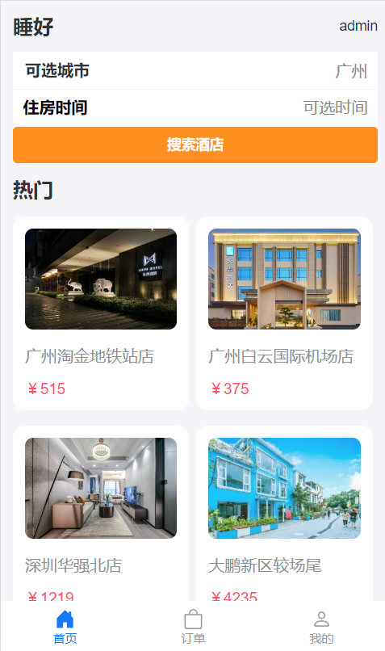
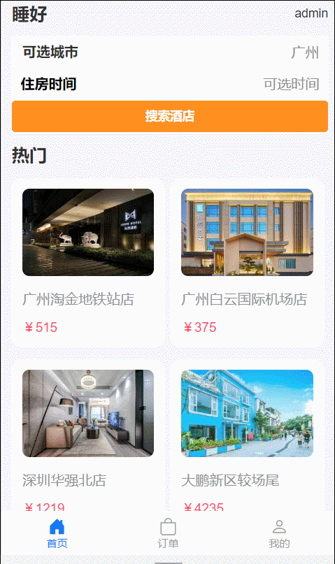
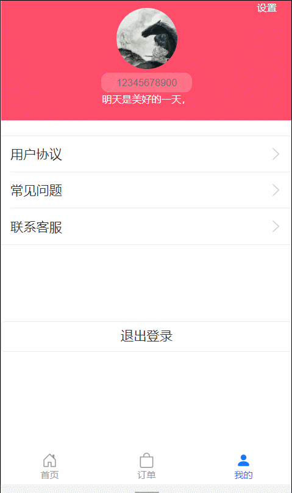
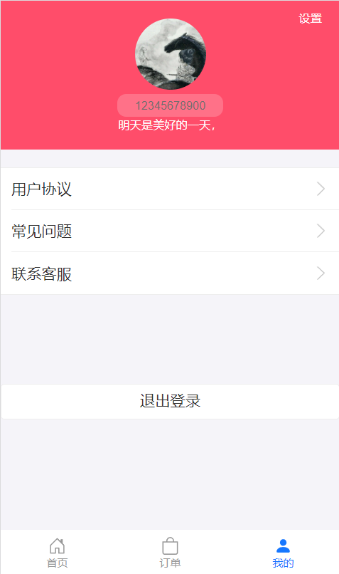
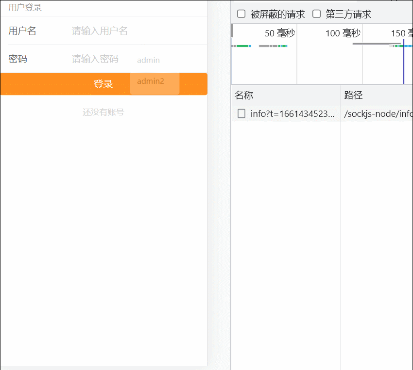

# Guesthouse

react(umi)+egg 全栈 酒店平台

## 介绍

一个简单的入门练手全栈项目

(未完成)

## 技术栈

- React：不多介绍了。
- UmiJsr: 插件化的前端应用框架，我觉得可以当作是 react 的工具包，方便使用 react 开发项目

  - 包含 React 脚手架
  - 集成路由管理
  - 数据 mock
  - ...其余相关插件

- eggjs：nodejs 的一个框架

  - 严格项目管理规范
  - 支持路由配置
  - server 服务
  - 模板渲染
  - 默认支持许多插件

## 背景

对全栈开发感兴趣

- 加深前端知识理解同时了解后端知识
  - 操作数据库
  - 搭建后端系统
- 能进行简单的全栈开发
  - egg
- 业务需求基础上
  - 系统优化
  - 安全问题

## appearance

### 首页

### 详情

### 订单

### user

### login

### logout

### edit

